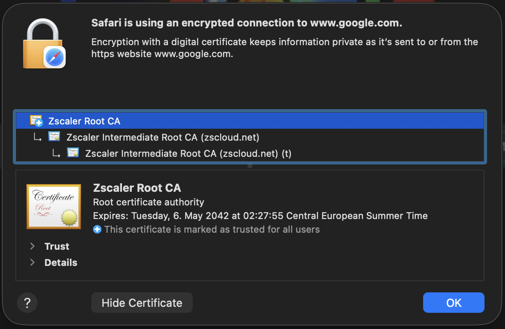

# Handling SSL Inspection & Proxies

This guide explains how corporate SSL inspection ("man-in-the-middle" proxies) affects VMs and how this project
automatically handles certificate installation. If you're behind a corporate proxy using tools like ZScaler or Netskope,
read this before running `vagrant up`.

### Content

- [What is SSL Inspection?](#what-is-ssl-inspection)
- [Why Does This Break Things?](#why-does-this-break-things)
- [How This Project Handles It](#how-this-project-handles-it)
- [Configuring Vagrant for SSL Inspection](#configuring-vagrant-for-ssl-inspection)
- [Setup Instructions](#setup-instructions)
  - [How to Get the CA Certificate](#how-to-get-the-ca-certificate)

## What is SSL Inspection?

Many corporate networks use a **proxy server** that inspects encrypted HTTPS traffic. Products like **ZScaler**,
**Netskope**, or **Palo Alto** sit between your computer and the internet, decrypting traffic to scan for threats before
re-encrypting it.

To do this, the proxy acts as a "man in the middle". It presents its _own_ SSL certificate to your computer instead of
the real website's certificate. Your company installs a **root CA certificate** on managed devices so they trust the
proxy's certificates.

## Why Does This Break Things?

When you spin up a fresh VM, it doesn't have your company's root certificate installed. Tools like `curl`, `wget`,
`pip`, `npm`, and `git` will fail with errors like:

```text
[SSL: CERTIFICATE_VERIFY_FAILED] Unable to get local issuer certificate
```

Each tool also maintains its own certificate store, so even installing the certificate system-wide isn't always enough.

## How This Project Handles It

This project automates the entire certificate setup:

1. **Auto-detection**: Any `.crt` files in the `config/` directory are automatically uploaded to the VM
2. **System-wide installation**: Certificates are added to `/usr/local/share/ca-certificates/` and registered with
   `update-ca-certificates`
3. **Tool-specific configuration**: Environment variables are set so all common tools use the system certificate store:

   | Variable              | Used by                 |
   | --------------------- | ----------------------- |
   | `REQUESTS_CA_BUNDLE`  | Python requests library |
   | `SSL_CERT_FILE`       | OpenSSL, Ruby, others   |
   | `NODE_EXTRA_CA_CERTS` | Node.js                 |
   | `CURL_CA_BUNDLE`      | curl                    |

4. **Package manager config**: `pip` and `npm` are explicitly configured to use the system CA bundle

## Configuring Vagrant for SSL Inspection

Before the VM can even be provisioned, **Vagrant itself** needs to trust your company's CA certificate. Without this,
Vagrant will fail to download boxes or communicate with the VM.

[Export your company's root certificate](#how-to-get-the-ca-certificate) and append it to Vagrant's embedded CA bundle:

```bash
# macOS location
cat /path/to/your-company-ca.crt >> /opt/vagrant/embedded/cacert.pem
```

> ⚠️ **Important**: This step must be done once on your host machine before running `vagrant up` for the first time.
> After Vagrant updates, you may need to repeat this step as the `cacert.pem` file possibly gets replaced.

## Setup Instructions

1. **Export your company's root certificate** as a `.crt` file

2. **Place it in the `config/` directory**:

   ```bash
   cp /path/to/your-company-ca.crt config/
   ```

3. **Run provisioning** - the certificate will be automatically detected and installed:

   ```bash
   vagrant up
   # Or if the VM already exists:
   vagrant provision --provision-with configure-proxy
   ```

Multiple certificates are supported - just place all `.crt` files in the `config/` directory.

> 💡 **Tip**: The `./setup.sh` wizard can also copy certificates for you during initial configuration.

### How to Get the CA Certificate

#### 1. Find out which certificate to export

1. Open Safari and navigate to any website (e.g., `https://google.com`)
2. Click the Safari options menu -> _Connection Security Details_

   

3. Click on **Show Certificate**. The top most certificate in the hierarchy is usually your company's root CA.

   

#### 2. Export the certificate using Keychain Access

1. Open the **Keychain Access** application on your Mac
2. Find the certificate you identified previously (it should be listed under "System" or "System Roots")
3. Right-click on the certificate and select **Export "Certificate Name"...**

## See Also

- [Troubleshooting](troubleshooting.md) — Common issues including SSL errors
- [Configuration](configuration.md) — Environment variables and proxy settings
- [Technical Details](technical_details.md) — How the provisioning pipeline works
