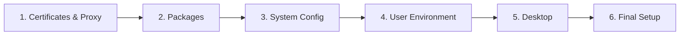

# Technical Details

This guide explains the technical architecture behind the project: how the provisioning pipeline works, why we chose
Vagrant with UTM as the virtualization backend, and the rationale for using Debian with Kali repositories instead of a
pure Kali image.

### Content

- [Provisioning Modes](#provisioning-modes)
- [Feature Details](#feature-details)
- [How It Works](#how-it-works)
- [Why Vagrant + UTM?](#why-vagrant--utm)
- [Why not Kali Linux?](#why-not-kali-linux)

## Provisioning Modes

### Minimal Mode (Default)

Minimal Debian VM with fast provisioning (~10 minutes) and essential tools:

- curl, wget, git, vim, zsh, htop, tmux, openvpn, ...
- Python 3 with pip/pipx
- Build essentials (gcc, make, etc.)

### Full Mode

Complete **development & security toolkit** (~20-30 minutes), includes everything in minimal plus:

- **Developer Tools**: Node.js, npm, Docker, docker-compose
- **Kali Tools**: nmap, sqlmap, john, hydra, wireshark, aircrack-ng, burpsuite, metasploit
- **Python Security Packages**: impacket, bloodhound, crackmapexec, scapy, pwntools
- **Wordlists**: rockyou.txt

To use full mode:

```bash
# During setup, select "full" when prompted
./setup.sh

# Or set the environment variable
export PROVISIONING_MODE=full
vagrant up

# Or upgrade an existing minimal VM
PROVISIONING_MODE=full vagrant provision
```

## Feature Details

### Desktop Environments

You can optionally install a desktop environment for graphical access:

| Option  | Description                                      | Resources       |
| ------- | ------------------------------------------------ | --------------- |
| `none`  | Headless (default) - command-line only           | Minimal         |
| `xfce`  | Kali's default - lightweight, fast               | 4 GB RAM, 2 CPU |
| `gnome` | Modern, polished - macOS-like experience         | 8 GB RAM, 4 CPU |
| `kde`   | Feature-rich - highly customizable, Windows-like | 8 GB RAM, 4 CPU |

Set via `DESKTOP_ENVIRONMENT` environment variable or through `./setup.sh`.

### Shared Folders

Two directories are automatically synced between your Mac and the VM:

| Host (Mac)    | Guest (VM)    | Purpose              |
| ------------- | ------------- | -------------------- |
| `./projects/` | `~/projects/` | Your project files   |
| `./shared/`   | `~/shared/`   | General file sharing |

Changes in either location are instantly reflected in the other.

### Network & Port Forwarding

The following ports are forwarded from the VM to your host:

| Guest Port | Host Port | Purpose                     |
| ---------- | --------- | --------------------------- |
| 8080       | 8080      | Burp Suite / ZAP Proxy      |
| 4444       | 4444      | Metasploit / Reverse shells |
| 8000       | 8000      | HTTP server                 |

## How It Works

When you run `vagrant up`, the VM goes through a **6-stage provisioning pipeline** to set you up with a ready-to-use
Debian-based security/development environment.



### Stage Breakdown

1. **Certificates & Proxy** (`configure-proxy.sh`)

   - Detects any `.crt` files in `config/`
   - Installs certificates to `/usr/local/share/ca-certificates/`
   - Configures proxy environment variables for all tools

2. **Packages** (`install-packages-minimal.sh` or `install-packages-full.sh`)

   - Updates the system and installs tools
   - Minimal mode: essential CLI tools only
   - Full mode: adds Kali repositories and security tools

3. **System Config** (`system-config.sh`)

   - Sets timezone, keyboard layout, and locale
   - Configures system-level preferences

4. **User Environment** (`user-config.sh`)

   - Installs Oh My Zsh with plugins
   - Creates directory structure (`~/projects`, `~/tools`, etc.)
   - Adds shell aliases and helper scripts

5. **Desktop Environment** (`install-desktop.sh`)

   - Installs selected desktop environment (if not `none`)
   - Configures display manager and auto-login

6. **Final Setup** (`final-provision.sh`)
   - Configures UFW firewall rules
   - Hardens SSH configuration
   - Runs verification checks

## Why Vagrant + UTM?

Running VMs on Apple Silicon Macs is tricky. VirtualBox doesn't support ARM64, VMware Fusion has limited ARM support,
and Parallels is paid software.

**The solution:** [UTM](https://mac.getutm.app/) is a free, open-source virtualization app built specifically for
macOS - and it works great on Apple Silicon. It uses QEMU under the hood but provides a native and very fast macOS
experience.

[Vagrant](https://www.vagrantup.com/) adds the "Infrastructure as Code" layer on top. Instead of manually clicking
through UTM's UI to create VMs, you define everything in a `Vagrantfile`. This means:

- **Reproducible**: Run `vagrant up` and get the exact same VM every time
- **Shareable**: Commit the config to Git, share with your team
- **Automated**: No manual setup - provisioning scripts handle everything

The [`vagrant_utm`](https://github.com/naveenrajm7/vagrant_utm) plugin bridges Vagrant and UTM, letting you use familiar
Vagrant commands (`vagrant up`, `vagrant ssh`, `vagrant destroy`) with UTM as the backend.

## Why not Kali Linux?

As this project lets you create a security VM very similar to Kali, you might wonder: "Why not just use a Kali Linux
image directly?"

**The short answer:** There's no official Kali Linux Vagrant box for ARM64/UTM.

**The longer answer:** This project takes a hybrid approach that's actually _better_ than pure Kali:

1. **Base image**: We use **Debian 12** (`utm/bookworm`) - a stable, well-tested ARM64 image built for UTM
2. **Kali repositories**: We add the official Kali repos as a secondary package source
3. **APT pinning**: We set Kali packages to Priority 100, meaning:
   - Debian packages are always preferred (better stability)
   - Kali packages are only used for security tools not available on Debian

This gives you the best of both worlds: Debian's solid stability for the base system, plus access to Kali's security
tools when you need them. It's also more resilient in corporate environments where `kali.org` domains might be blocked.
The VM still works, you just won't have the security tools until you get the repos whitelisted (or install them
manually).

## See Also

- [Configuration](configuration.md) — Environment variables and Vagrant commands
- [SSL Inspection & Proxies](ssl_inspection_and_proxies.md) — Certificate setup for corporate networks
- [Troubleshooting](troubleshooting.md) — Common issues and solutions
